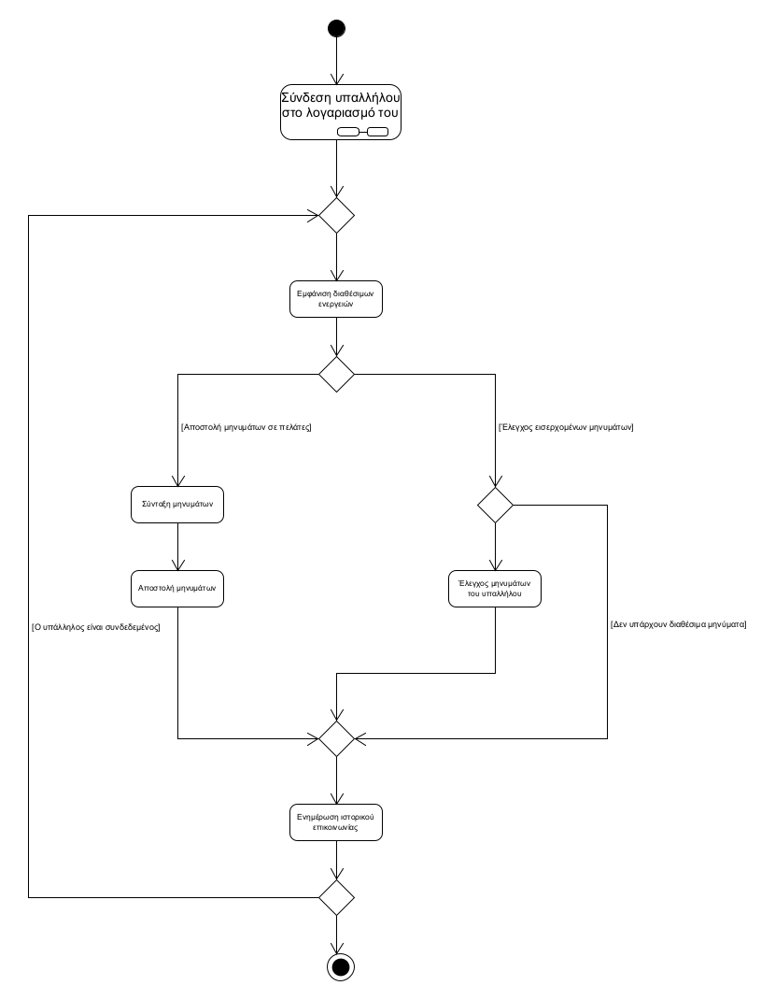
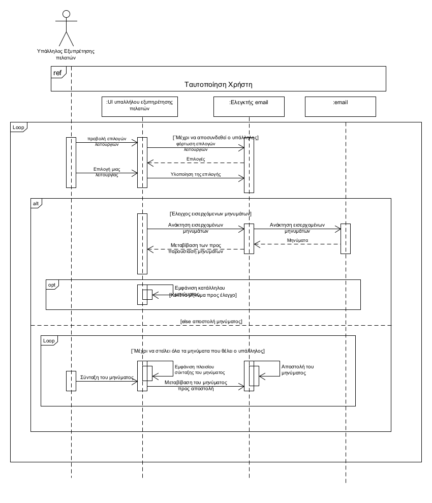

**ΠΕΡΙΠΤΩΣΗ ΧΡΗΣΗΣ: ΕΠΙΚΟΙΝΩΝΙΑ ΜΕ ΤΟΥΣ ΠΕΛΑΤΕΣ**

**Πρωτεύων Actor**: Υπάλληλος Εξυπηρέτησης πελατών  
**Ενδιαφερόμενοι**:  
Υπάλληλος Εξυπηρέτησης πελατών: Θέλει να απαντά στα μηνύματα των πελατών και να στέλνει σε αυτούς ενημερωτικά μηνύματα
Πελάτες: Θέλουν να στέλνουν μηνύματα που αφορούν τις παραγγελίες τους

**Βασική ροή**  
1. Ο υπάλληλος εξυπηρέτησης πελατών συνδέεται στο λογαριασμό του
2. Το σύστημα του εμφανίζει τις διαθέσιμες ενέργειες,δηλαδή:  
   * Έλεγχος εισερχομένων μηνυμάτων
   * Αποστολή μηνυμάτων σε πελάτες
3. Ο υπάλληλος ελέγχει τα εισερχόμενα μηνύματά του από πελατες
4. Το σύστημα ενημερώνει το ιστορικό επικοινωνίας υπαλλήλου και πελάτη
5. Επανάληψη του βήματος 2 μέχρι να αποσυνδεθεί ο υπάλληλος από το λογαριασμό του

**Εναλλακτικές ροές**  
3α. Δεν υπάρχουν νέα μηνύματα πελατών  
1. Το σύστημα εμφανίζει σχετικό μήνυμα 
   
3β. Ο υπάλληλος στέλνει μήνυμα σε κάποιον πελάτη  
1. Σύνταξη του μηνυμάτων
2. Αποστολή του μηνυμάτων

    Διάγραμμα δραστηριοτήτων  

    Διάγραμμα ακολουθίας  
    
