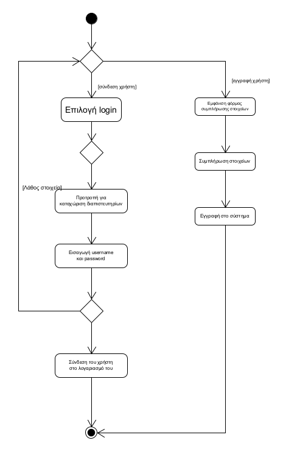
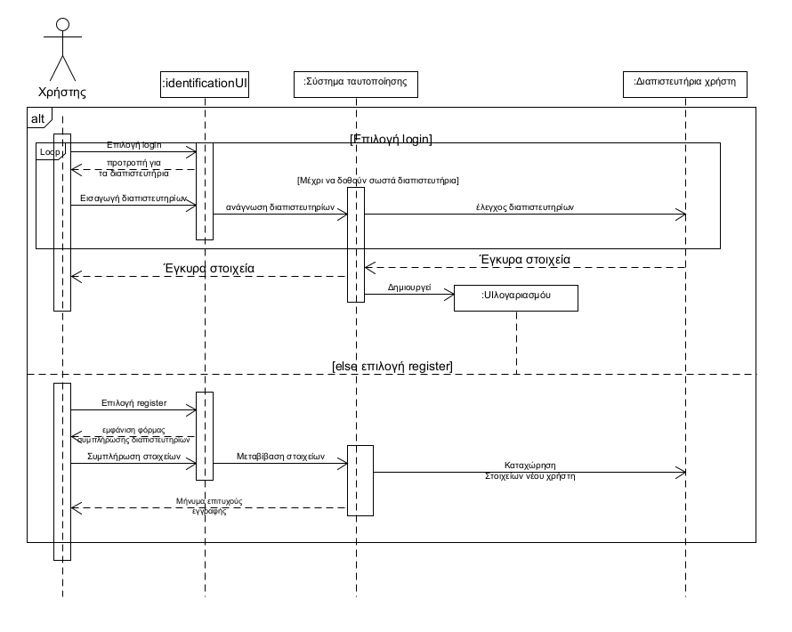

**ΠΕΡΙΠΤΩΣΗ ΧΡΗΣΗΣ: ΤΑΥΤΟΠΟΙΗΣΗ ΧΡΗΣΤΗ**

**Πρωτεύων Actor**: Χρήστης εφαρμογής  
**Δευτερεύων Actor**: Σύστημα ταυτοποίησης  
**Ενδιαφερόμενοι**:  
Χρήστης: Θέλει να συνδεθεί στο σύστημα, στην αντίστοιχη με το ρόλο του διεπαφή  
Διαχειριστής(Admin): Θέλει ασφαλή πρόσβαση στο σύστημα  
Σύστημα ταυτοποίησης: Υλοποιεί τη σύνδεση του κάθε χρήστη με το λογαριασμό του

**Βασική ροή**   
1. Ο χρήστης επιλέγει login  
2. Το σύστημα εμφανίζει την προτροπή για καταχώρηση των διαπιστευτηρίων του χρήστη  
3. Ο χρήστης εισάγει username και password  
4. Το σύστημα τον εισάγει στη διεπαφή που αντιστοιχεί στο λογαριασμό του  

**Εναλλακτικές ροές**  
1α. Ο χρήστης μπορεί να επιλέξει register για εγγραφή ως μόνο ως πελάτης   
 1. Του εμφανίζεται μια φόρμα  
 2. Συμπληρώνει τα στοιχεία του
 3. Γίνεται η εγγραφή του στο σύστημα
    

4α. Τα διαπιστευτήρια που εισήχθησαν δεν αντιστοιχούν σε αυτά κάποιου χρήστη της εφαρμογής  
1. Το σύστημα εμφανίζει μήνυμα μη αναγνώρισης του χρήστη 
2. Επιστροφή στο βήμα 1

    Διάγραμμα δραστηριοτήτων

    Διάγραμμα ακολουθίας  
