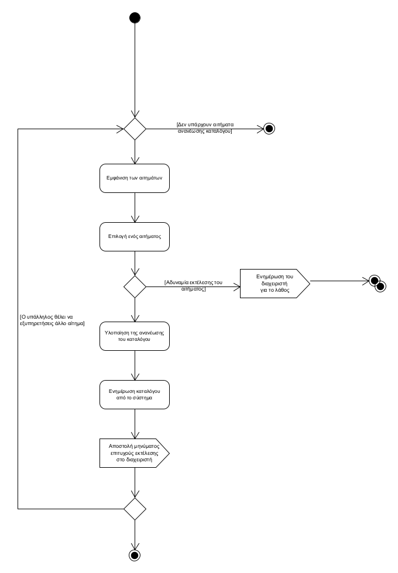
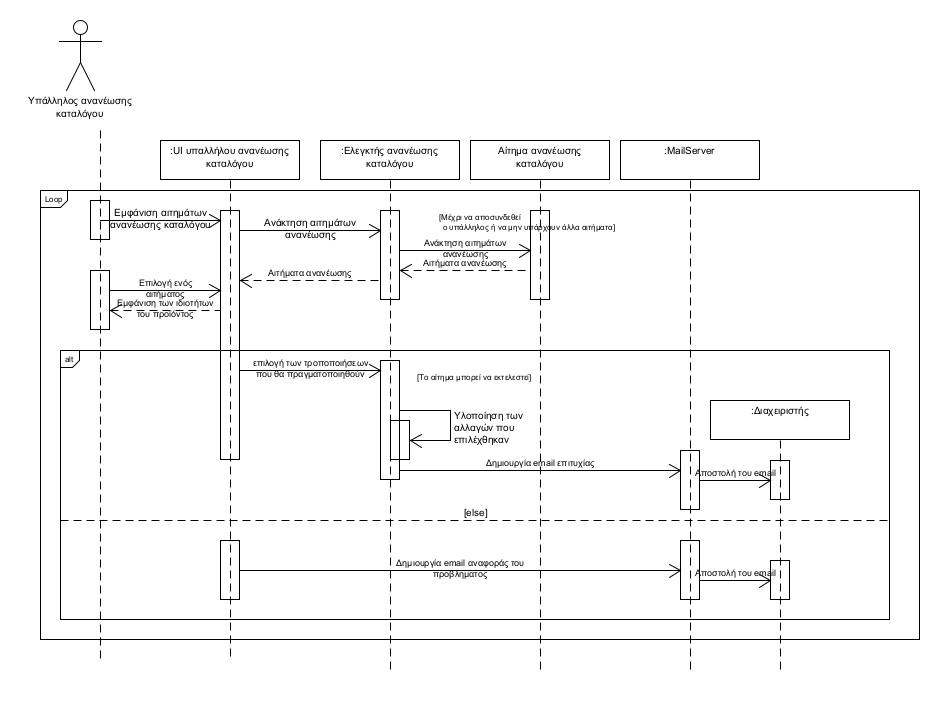

**ΠΕΡΙΠΤΩΣΗ ΧΡΗΣΗΣ: ΑΝΑΝΕΩΣΗ ΤΟΥ ΚΑΤΑΛΟΓΟΥ ΤΩΝ ΠΡΟΪΟΝΤΩΝ**

**Πρωτεύων Actor**: Υπάλληλος ανανέωσης καταλόγου  
**Ενδιαφερόμενοι**:  
Υπάλληλος ανανέωσης καταλόγου: Θέλει να ανανεώσει/τροποποιήσει τον κατάλογο των προϊόντων που διατίθενται προς πώληση από το κατάστημα
Διαχειριστής(Admin): Θέλει να διασφαλίση την έγκαιρη και σωστή ανανέωση του καταλόγου  
**Προϋποθέσεις:**  
1.Πρέπει να έχει γίνει αίτημα ανανέωσης του καταλόγου από τον διαχειριστή  
2.Ο υπάλληλος έχει συνδεθεί στο λογαριασμό του

**Βασική ροή**  
1. Ελέγχει τα αιτήματα για ανανέωση του καταλόγου του καταστήματος από τον διαχειριστή
2. Επιλέγει ένα αίτημα
3. Κάνει την κατάλληλη ως προς το αίτημα ανανέωση του καταλόγου
4. Ενημερώνει τον διαχειριστή για την εκτέλεσή της
5. Το σύστημα ενημερώνει τον κατάλογο
6. Τα βήματα 3 έως 6 επαναλαμβάνονται αν ο υπάλληλος θέλει να εξυπηρετήσει κάποιο άλλο αίτημα

**Εναλλακτικές ροές**  
1α. Δεν υπάρχουν διαθέσιμα αιτήματα για ανανέωση του καταλόγου
1. Η περίπτωση χρήσης τερματίζει

3α. Το αίτημα δεν μπορεί να εκτελεστεί, λόγω λάθους στα στοιχεία του προϊόντος στο μήνυμα του διαχειριστή  
1. Ο υπάλληλος ενημερώνει τον διαχειριστή για το πρόβλημα.
2. Η περίπτωση χρήσης τερματίζει 
   

    Διάγραμμα δραστηριοτήτων   

    Διάγραμμα ακολουθίας  
