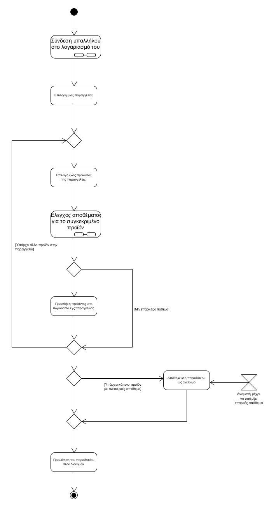
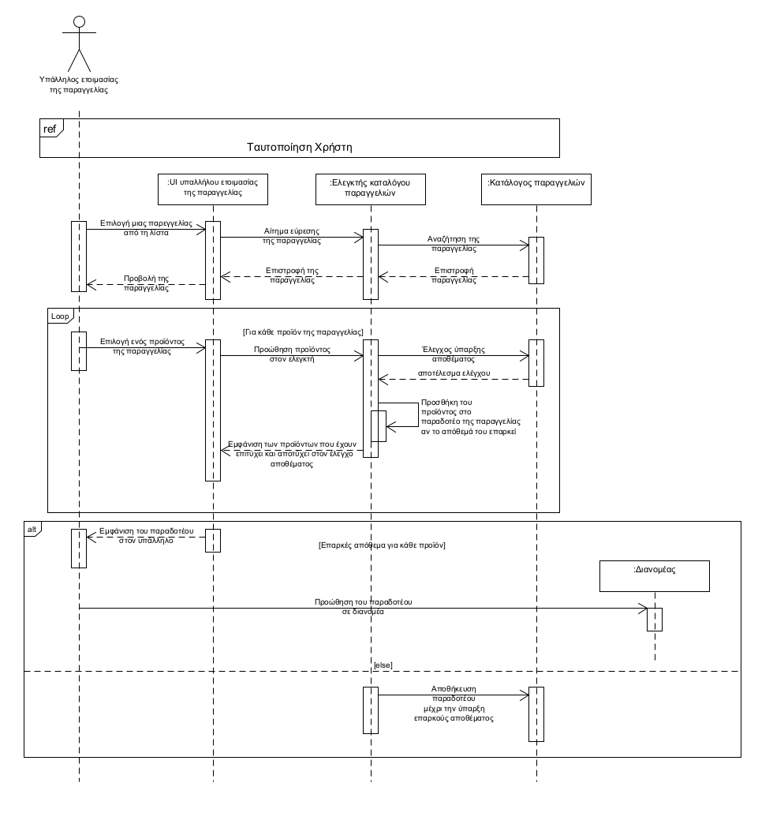

**ΠΕΡΙΠΤΩΣΗ ΧΡΗΣΗΣ: ΣΥΓΚΕΝΤΡΩΣΗ ΤΩΝ ΠΡΟΪΟΝΤΩΝ ΤΗΣ ΠΑΡΑΓΓΕΛΙΑΣ**

**Πρωτεύων Actor**: Υπάλληλος ετοιμασίας της παραγγελίας  
**Ενδιαφερόμενοι**:  
Υπάλληλος ετοιμασίας της παραγγελίας: Θέλει να συγκεντώσει όλα τα προϊόντα της παραγγελίας
**Προϋποθέσεις**:  
Κάθε παραγγελία έχει τουλάχιστον ένα προϊόν

**Βασική ροή**
1. Ο υπάλληλος ετοιμασίας παραγγελίας συνδέεται στο λογαριασμό του
2. Επιλέγει μία από τις παραγγελίες που έχουν γίνει
3. Επιλέγει ένα από τα προϊόντα της παραγγελίας
4. Κάνει έλεγχο αποθέματος του προϊόντος 
5. Προσθέτει το προϊόν στο παραδοτέο της παραγγελίας
6. Επανάληψη των βημάτων 3-5 για όλα τα προϊόντα της παραγγελίας
7. Προώθηση του παραδοτέου σε κάποιο διανομέα

**Εναλλακτικές ροές**  
5α. Ανεπαρκές απόθεμα για το συγκεκριμένο προϊόν    
  1. Αποστολή μηνύματος σε υπάλληλο εξυπηρέτησης πελατών για ενημέρωση του  πελάτη για καθυστέρηση παράδοσης της παραγγελίας του
  2. Επιστροφή στον βήμα 3.  

7α. Υπάρχει κάποιο προϊόν με ανεπαρκές απόθεμα  
  1. Αποθήκευση του παραδοτέου ως ανέτοιμο
  2. Όταν γίνει επαρκές το απόθεμα, αυτόματη συμπλήρωση σε όποιο προϊόν χρειάζεται
  3. Προώθηση σε διανομέα για παράδοση

  Διάγραμμα δραστηριοτήτων   

  Διάγραμμα ακολουθίας  
