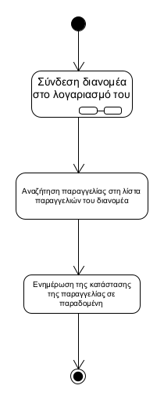
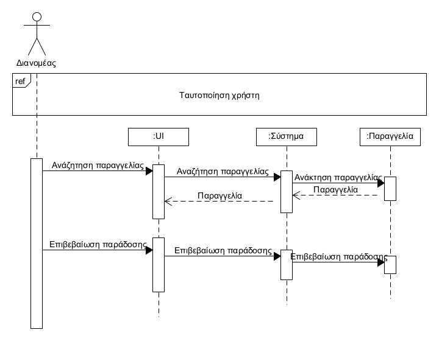

**ΠΕΡΙΠΤΩΣΗ ΧΡΗΣΗΣ : ΠΑΡΑΔΟΣΗ ΠΑΡΑΓΓΕΛΙΑΣ / ΟΛΟΚΛΗΡΩΣΗ ΤΗΣ ΔΙΑΔΙΚΑΣΙΑΣ**

**Πρωτεύων Actor** : Διανομέας  
**Ενδιαφερόμενοι** :   
 Διαχειριστής : Επιθυμεί την ομαλή παράδοση της παραγγελίας  
 Διανομέας : Είναι υπεύθυνος για την παράδοση της παραγγελίας  
 Πελάτης : Θέλει να παραλάβει την παραγγελία που ζήτησε  
 **Προϋποθέσεις**: Η παραγγελία υπάρχει στο σύστημα από τα προηγούμενα στάδια 

 **Βασική Ροή** :  
 1) Πραγματοποιείται η ταυτοποίηση από το σύστημα  
 2) Ο διανομέας αναζητάει την παραγγελία στη λιστα με τις παραγγελιες του  
 3) Αφού την βρει ενημερώνει την κατάστασή της  

   Διάγραμμα δραστηριοτήτων  
  

   Διάγραμμα ακολουθίας

