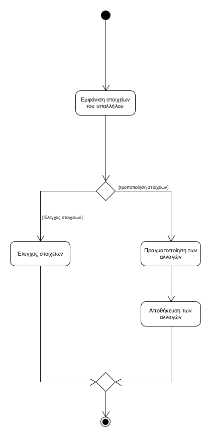
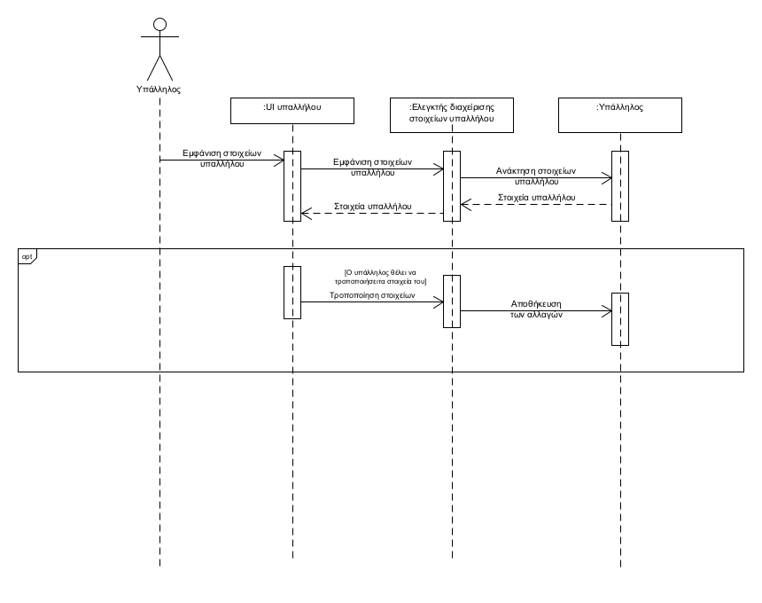

**ΠΕΡΙΠΤΩΣΗ ΧΡΗΣΗΣ: Διαχείριση στοιχείων υπαλλήλου**

**Πρωτεύων Actor**: Υπάλληλος  
**Ενδιαφερόμενοι**:  
Υπάλληλος: Θέλει να δει και -αν το επιθυμεί- να μεταβάλει τα στοιχεία του  
**Προϋποθέσεις**  
1.Ο υπάλληλος έχει συνδεθεί στο λογαριασμό του

**Βασική ροή**

1. Το σύστημα του εμφανίζει τα στοιχεία που αυτός έχει καταχωρήσει(με δυνατότητα τροποποίησης)
2. Ο υπάλληλος ελέγχει χωρίς να τα τροποποιήσει

**Εναλλακτικές ροές**  
2α. Ο υπάλληλος θέλει να τροποποιήσει τα στοιχεία του

1. Ο υπάλληλος κάνει όσες αλλαγές επιθυμεί στα στοιχεία του
2. Το σύστημα αποθηκεύει τις αλλαγές στα στοιχεία του υπαλλήλου

   Διάγραμμα δραστηριοτήτων  

   Διάγραμμα ακολουθίας  
  

