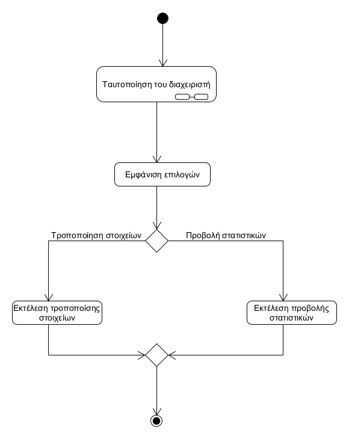
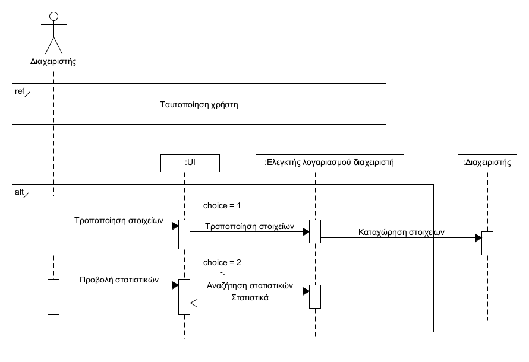

**ΠΕΡΙΠΤΩΣΗ ΧΡΗΣΗΣ : ΔΙΑΧΕΙΡΙΣΗ ΛΟΓΑΡΙΑΣΜΟΥ ΔΙΑΧΕΙΡΙΣΤΗ**

**Πρωτεύων Actor** : Διαχειριστής  
**Ενδιαφερόμενοι**:  
Διαχειριστής : Τροποποιεί όποια στοιχεία του λογαριασμού του επιθυμεί  
**Προϋποθέσεις** : Ο διαχειριστής έχει ενεργό λογαριασμό στην εφαρμογή  

**Βασική Ροή** :  
1) Ο διαχειριστής συνδέεται στο σύστημα
2) Του εμφανίζεται η επιλογή τροποποίησης των στοιχείων του λογαριασμού του και η επιλογή προβολής στατιστικών του καταστήματος  
3) Επιλέγει και εκτελεί όποια από τισ ενέργειες επιθυμεί  

   Διάγραμμα δραστηριοτήτων  
  

   Διάγραμμα ακολουθίας

