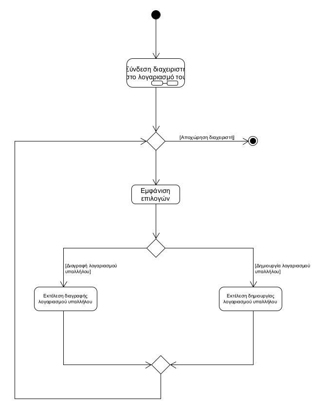
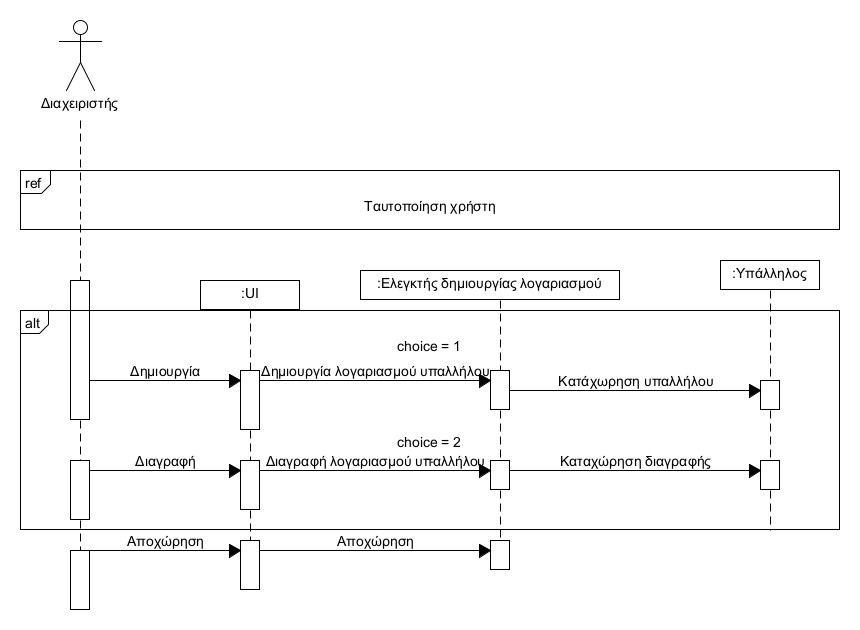

**ΠΕΡΙΠΤΩΣΗ ΧΡΗΣΗΣ : ΔΗΜΙΟΥΡΓΙΑ / ΔΙΑΓΡΑΦΗ ΛΟΓΑΡΙΑΣΜΟΥ ΥΠΑΛΛΗΛΟΥ**

**Πρωτεύων Actor** : Διαχειριστής  
**Ενδιαφερόμενοι**:  
Διαχειριστής : Διαγράφει τους λουγαριασμούς υπαλλήλων οι οποίοι δεν εργάζονται πλεον στο καταστημα  
Υπάλληλος : Θέλει να του δημιουργηθεί ή να διαγράψει λογαριασμό  
**Προϋποθέσεις** : Ο υπάλληλος να εργάζεται στο κατάστημα για να δημιουργηθεί ο λογαριαμός του ή να έχει σταματήσει να εργαζεται για να διαγραφεί ο λογαριασμός  

**Βασική Ροή** :  
1) Ο διαχειριστής συνδέεται στο σύστημα
2) Του εμφανίζονται οι επιλογές:
    - Δημιουργία λογαριασμού υπαλλήλου
    - Διαγραφή λογαριασμού υπαλλήλου  

3) Εκτέλεση μιας από τις παραπάνω επιλογές  
4) Επιστροφή στο βήμα 2  

**Εναλλακτική Ροή** :  
2α) Ο διαχειριστής θέλει να αποχωρήσει  
1) Τερματισμός περίπτωσης χρήσης

  Διάγραμμα δραστηριοτήτων  
  

  Διάγραμμα ακολουθίας  
