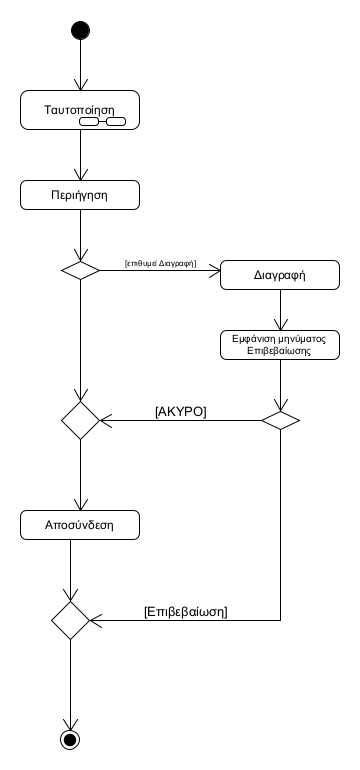
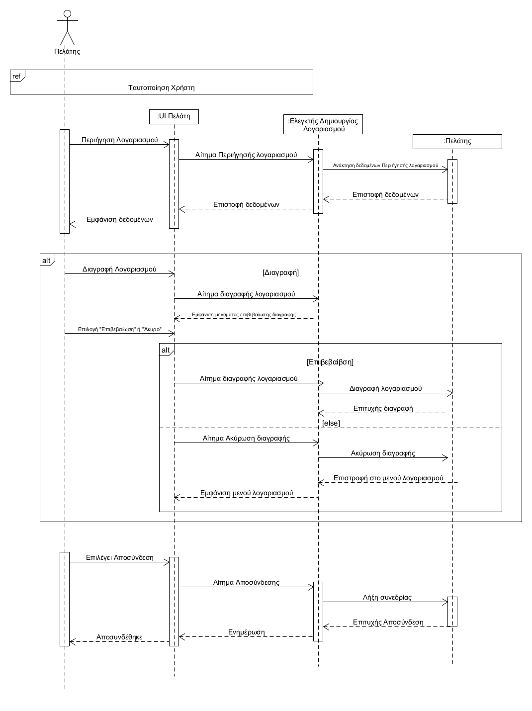

#### ΠΕΡΙΓΡΑΦΗ Π.Χ ΔΙΑΧΕΙΡΙΣΗ ΛΟΓΑΡΙΑΣΜΟΥ ΠΕΛΑΤΗ
##### Πρωτεύων Actor: Πελάτης
##### Ενδιαφερόμενοι: 
* Πελάτης: Θέλει να έχει πρόσβαση και να διαχειρίζεται τον λογαριασμό του
* Σύστημα:Πρέπει να παρέχει σύνδεση/εγγραφή
##### Προϋποθέσεις: 
##### Βασική Ροή:
1.Κάνει ταυτοποιήση για να συνδεθεί στην εφαρμογή(Συμπερίληψη Ταυτοποίησης, ΠΧ Ταυτοποίηση)
2. Περιηγείται στον λογαριασμό
3.Ο χρήστης αποσυνδέεται από τον λογαριασμό του
##### Εναλλακτικές Ροές:

3α. Ο χρήστης αν επιθυμεί, κάνει διαγραφή του λογαριασμού του
   1. Το σύστημα εμφανίζει μήνυμα επιβεβαίωσης
   2. Ο χρήστης επιλέγει Επιβεβαίωση διαγραφής ή Άκυρο
   2α. Αν ο χρήστης επιλέξει Άκυρο, τότε το σύστημα επιστρέφει στο μενού λογαριασμού (επιστροφή στη Βασική Ροή, βήμα 3 )
1. Ο χρήστης επιλέγει Επιβεβαίωση διαγραφής (Η ΠΧ τερματίζει)  

Διάγραμμα Δραστηριοτήτων 

Διάγραμμα Ακολουθίας

  