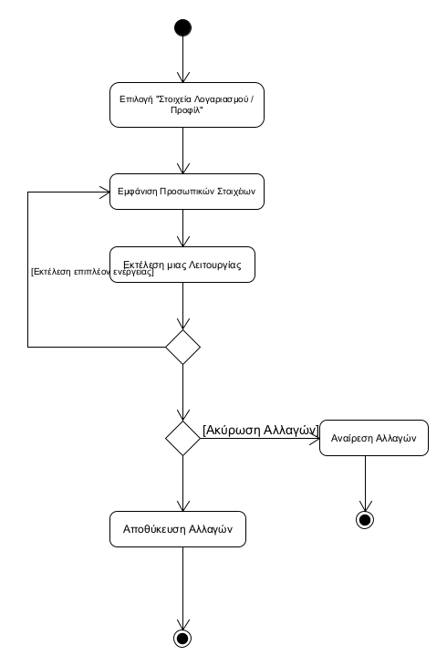
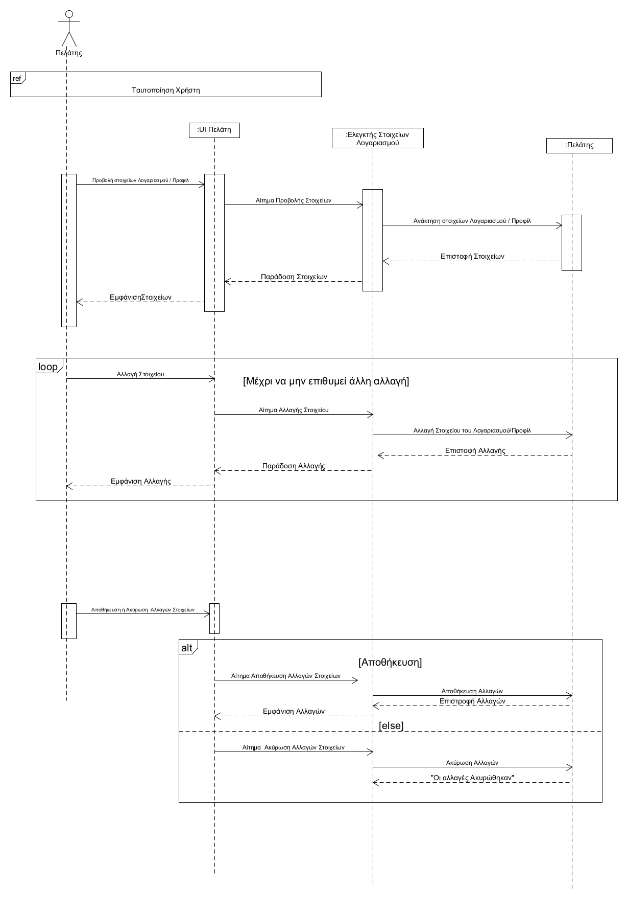

##### ΠΕΡΙΓΡΑΦΗ Π.Χ ΔΙΑΧΕΙΡΙΣΗ ΣΤΟΙΧΕΙΩΝ ΠΕΛΑΤΗ
##### Πρωτεύον Actor: Πελάτης
##### Ενδιαφερόμενοι: 
* Πελάτης: θέλει να διαχειριστεί τα στοιχεία του 
##### Προϋποθέσεις: 
Ο χρήστης έχει ήδη εισέλθει στην εφαρμογή μέσω της  Ταυτοποίησης

##### ΒΑΣΙΚΗ ΡΟΗ
1. Επιλέγει την ενότητα "Στοιχεία Λογαριασμού / Προφίλ" στο μενού της εφαρμογής.
2. Το σύστημα εμφανίζει τα αποθηκευμένα προσωπικά στοιχεία του χρήστη και τα οποία μπορεί να αλλάξει, δηλαδή:
   * Αλλαγή ονόματος (username)
   * Αλλαγή κωδικού πρόσβασης (password)
   * Αλλαγή διεύθυνσης
   * Αλλαγή τηλ./email επικοινωνίας
   * Απλή προβολή στοιχείων
3. Ο χρήστης εκτελεί μία από αυτές τις ενέργειες 
4. Επιλέγει "Αποθήκευση" και το σύστημα ενημερώνει τις αλλαγές  
5. Η ΠΧ τερματίζει
##### ΕΝΑΛΑΚΤΙΚΕΣ ΡΟΕΣ
4α.Αν ο χρήστης επιλέξει «Ακύρωση»
1. Το σύστημα αναιρεί τις αλλαγές 
2. Η ΠΧ τερματίζει

Διάγραμμα Δραστηριοτήτων 

Διάγραμμα Ακολουθίας
