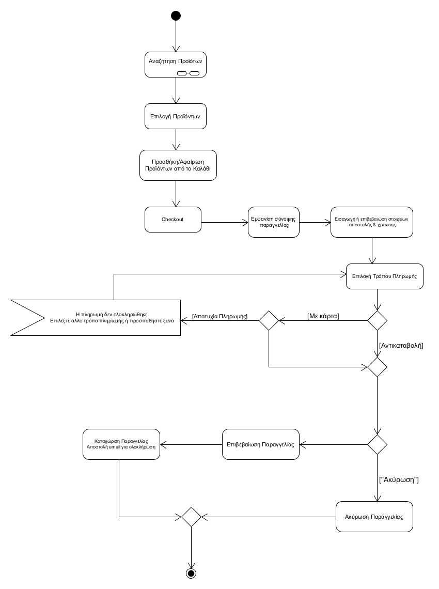
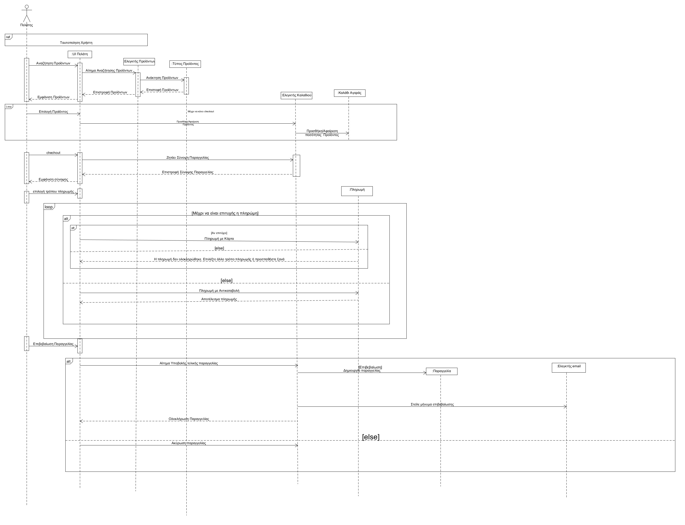

##### ΠΕΡΙΓΡΑΦΗ Π.Χ ΠΡΑΓΜΑΤΟΠΟΙΗΣΗ ΠΑΡΑΓΓΕΛΙΑΣ ΠΕΛΑΤΗ
##### Πρωτεύον Actor: Πελάτης
##### Ενδιαφερόμενοι: 
Πελάτης: θέλει να υποβάλλει μία παραγγελία.
 
##### Προϋποθέσεις: 
Ο χρήστης έχει ήδη εισέλθει στην εφαρμογή μέσω της  Ταυτοποίησης

##### ΒΑΣΙΚΗ ΡΟΗ
1.Ο χρήστης περιηγείται/αναζητά τα διαθέσιμα προϊόντα(Συμπερίληψη Περιήγηση στο κεντρικό μενού, ΠΧ Αναζήτηση Προϊότων )
2.Ο χρήστης επιλέγει προϊόντα 
3.Προσθέτει/αφαιρεί προϊόντα από το Καλάθι Αγορών.
4.Ο χρήστης επιλέγει «Checkout» 
5.Το σύστημα εμφανίζει σύνοψη παραγγελίας (προϊόντα, ποσότητες, συνολικό κόστος)
6.Ο χρήστης εισάγει ή επιβεβαιώνει στοιχεία αποστολής και χρέωσης
7.Ο χρήστης επιλέγει τρόπο πληρωμής:
* Αντικαταβολή
* Με κάρτα 

8.Ο χρήστης επιλέγει «Επιβεβαίωση Παραγγελίας»
9.Το σύστημα καταχωρεί την παραγγελία και αποστέλλει email στον πελάτη με επιβεβαίωση επιτυχούς ολοκλήρωσης της παραγγελίας

##### ΕΝΑΛΑΚΤΙΚΕΣ ΡΟΕΣ
 
7α.Αν η πληρωμή με κάρτα αποτύχει
1. Ενημερώνεται ο χρήστης: «Η πληρωμή δεν ολοκληρώθηκε. Επιλέξτε άλλο τρόπο πληρωμής ή προσπαθήστε ξανά»
  2. Επιστροφή στο βήμα 6

8α. Ο χρήστης αν θέλει να ακύρωσει την παραγγελία του  επιλέγει «Ακύρωση» 
1. Η ΠΧ τερματίζει

Διάγραμμα Δραστηριότητων

Διάγραμμα Ακολουθίας
